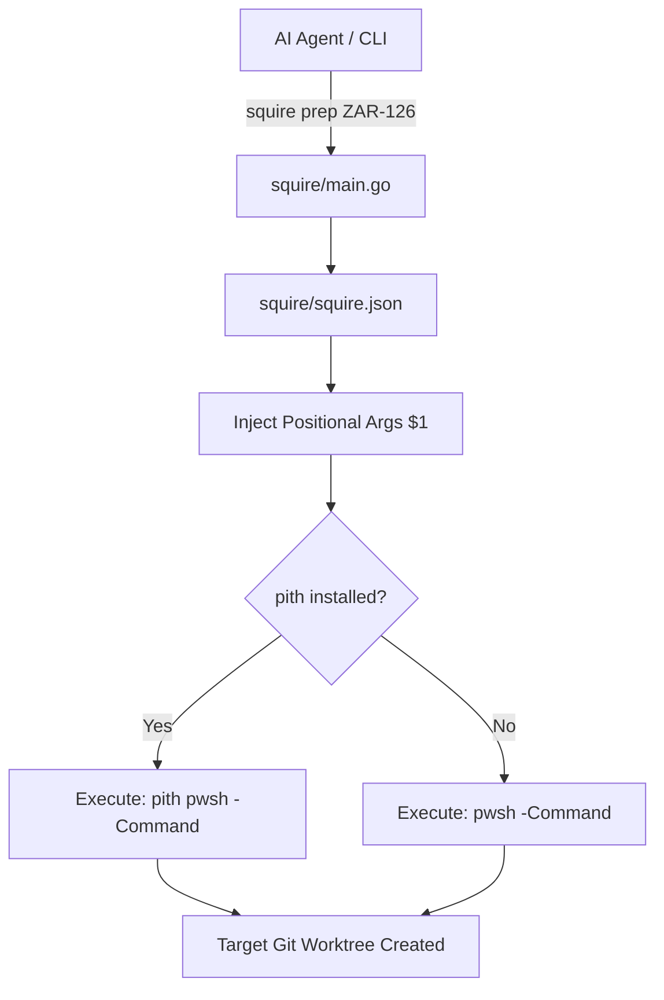

# Squire

Squire is a generic, Pith-compatible macro execution engine for AI agents and estate-wide automation. It reads local `squire.json` configuration files and dynamically maps string keys to raw shell execution, injecting positional arguments and preserving token-optimization wrappers if `pith` is present on the system.

## Thneed Architecture Diagram



## Installation

```bash
go install github.com/Zkrausman/Squire@latest
```

## Usage

1. Create a `squire.json` file in the root of any repository:
```json
{
  "macros": {
    "prep": "git fetch origin main; git worktree add ../ai-workspaces/$1 origin/main",
    "version": "echo \"v1.0.0\""
  }
}
```

2. Execute the macro using the key:
```bash
squire prep ZAR-126
```

Squire will automatically proxy the underlying bash/pwsh commands and substitute `$1` with `ZAR-126`.
